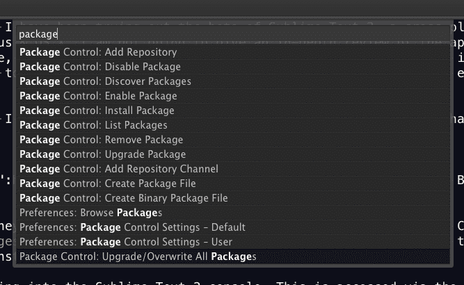

**[UPDATE 11 May 2013]** This information is extremely out of date, please visit the wiki I created for up-to-date information: [github.com/mrmartineau/SublimeTextSetupWiki/wiki](https://github.com/mrmartineau/SublimeTextSetupWiki/wiki)

**[UPDATE 15 Dec 2011]** Added some more plugins to the list.

**[UPDATE 17 Dec 2011]** Added my key binding settings & 'Textmate-style' comment banner keyboard shortcut snippet

Over the past few weeks I have been trying out the beta of Sublime Text 2, a cross-platform text editor for Windows, Linux & OS X. I am not going to give an in-depth review of the app, many people have done that before me, but suffice it to say, I love it & think you should check it out too. **This post’s purpose is to help enhance your experience of it by providing info for extending & customising the app.**

It should be known that I am a front-end developer so my suggestions will reflect that.

## Plugins / Packages

### 1. [Package Control](http://wbond.net/sublime_packages/package_control) by [Will Bond](http://wbond.net/)

The first package (as they’re known in Sublime), you should install is [Package Control](http://wbond.net/sublime_packages/package_control). It makes installing, updating & keeping track of packages painless. To install this package, follow these instructions:

Copy & paste the following into the Sublime Text 2 console. This is accessed via the ctrl+\` shortcut.

```py
import urllib2,os;pf='Package Control.sublime-package';ipp=sublime.installed_packages_path();os.makedirs(ipp) if not os.path.exists(ipp) else None;open(os.path.join(ipp,pf),'wb').write(urllib2.urlopen('http://sublime.wbond.net/'+pf.replace(' ','%20')).read())
```

Note: please check the [Package Control website](http://wbond.net/sublime_packages/package_control) for details prior to installing the package - as a rule, one should make sure they have the latest version of Sublime before installing.


#### Installing packages through ‘Package Control’

Bring up the Sublime prompt by pressing `super+shift+p` — super = Cmd (on Mac) or Windows (on PC) — start typing the word package & you should get a list of all the commands relating to installing, removing & managing packages. (Cheers Will)



Navigate to the `Package Control:Install Package` item & hit enter, then browse the list & select the ones you want. After you paste the provided command into the console, you need to restart Sublime Text to finish the installation. Once Package Control is installed, future package installations are instantaneous.

### 2. [SublimeCodeIntel](https://github.com/Kronuz/SublimeCodeIntel)

Code intelligence plugin ported from Open Komodo Editor. A definite must
for any coder. Install this through ‘Package Control’

### 3. [ZenCoding](https://bitbucket.org/sublimator/sublime-2-zencoding)

Zen meets Sublime. Again, a definite must for any coder. Install this through ‘Package Control’.

### 4. [HTML5](https://github.com/mrmartineau/HTML5) by [me](http://zander.wtf)

I ported the HTML5 bundle from Textmate over to Sublime, this is the result. Install this through ‘Package Control’.

### 5. [Placeholders](https://github.com/mrmartineau/Placeholders) by [me](http://zander.wtf)

Lorem ipsum, dummy content, placeholder HTML. This little package has what you need. Install this through ‘Package Control’.

### 6. [jQuery](https://github.com/mrmartineau/Jquery) by [me](http://zander.wtf)

Another port from a Textmate bundle, it is still a work in progress but does work & if anyone feels like lending a hand, I don’t mind. Download the source from Github & place the contents into a `jQuery` folder in `/Application Support/Sublime Text 2/Packages` (at least it is on a Mac!).

### 7. [SublimeTagmatcher](https://github.com/pyparadigm/SublimeTagmatcher) by [pyparadigm](https://github.com/pyparadigm)

If you click inside the begin tag, it will highlight the end tag, and vice versa.

### 8. [Elastic Tabs Stops](https://github.com/adzenith/Sublime-plugins/blob/master/elastic_tabstops.py) by [adzenith](https://github.com/adzenith)

Incredibly useful plugin to make tabstops expand or shrink to fit their contents. ([More info on elastic tab stops](http://nickgravgaard.com/elastictabstops/))

### 9. [Increase/Decrease number by delta_value](https://github.com/rmaksim/Sublime-Text-2-Inc-Dec-Value) by [rmaksim](https://github.com/rmaksim)

Just look at the following images:


Installation tips: Download the script & put it into a folder called `RMaksimSublimeText2Solutions` within your `Packages` folder. Then open Sublime, the edit the `Key Bindings - User`


Now paste in the key bindings from [here](https://gist.github.com/mrmartineau/5734979#file-inc-dec-json):

Now restart Sublime. :)

### 10. [SideBarEnhancements](http://www.sublimetext.com/forum/viewtopic.php?f=5&t=3331) by [tito](https://github.com/titoBouzout/SideBarEnhancements)

Just what you’ve always wanted, a vastly improved right-click menu for
Sublime! Check the


View the gist of these settings at [gist.github.com/mrmartineau/5734979](https://gist.github.com/mrmartineau/5734979)

### More packages:

1.  Will Bond, creator of the ‘Package control’ package has a bunch of other very useful packages one can install, my favourite being the [Alignment](http://wbond.net/sublime_packages/alignment) package: [wbond.net/sublime_packages/](http://wbond.net/sublime_packages/)
2.  [github.com/Seldaek/sublime-plugins](https://github.com/Seldaek/sublime-plugins)
3.  [Javascript Formatter](http://www.sublimetext.com/forum/viewtopic.php?f=5&t=2430) - Beautify your shizzle
4.  [Case Conversion](http://www.sublimetext.com/forum/viewtopic.php?f=5&t=2350&p=10620#p10620) - Convert word to snake, camel, or pascal case
5.  Prefixr - Uses the [prefixr.com](http://prefixr.com/) API to add all the various vendor prefixes & code for CSS3 - **Install through Package Control**
6.  [GotoRecent]() - Plugin that adds a panel to reopen recently closed (deactivated) files by pressing ctrl+e (PC) or super+e (OSX) - **Install through Package Control**
7.  [BufferScroll](https://github.com/SublimeText/BufferScroll) Buffer Scroll is a simple plugin which remembers and restores the scroll and cursor positions, also the selections and foldings states - **Install through Package Control**
8.  [AlternativeAutocomplete]() This plugin adds an autocompletion command to Sublime Text 2 that acts similarly to TextMate - **Install through Package Control**
9.  [Open Include](https://github.com/SublimeText/Open-Include) This plugin will try to open on Sublime Text file paths found on selections when pressing “ALT+D” - **Install through Package Control**
10. [Clipboard History](https://github.com/kemayo/sublime-text-2-clipboard-history) Keep a history of your clipboard items. Let you paste them back in, as needed. ctrl-alt-v (PC) or ctrl-alt-super-v (OSX) - **Install through Package Control**
11. [SaneSnippets](https://github.com/bobthecow/sublime-sane-snippets) Snippets optimized for humans, not robots - **Install through Package Control**
12. [Sublime Text Github organisation](https://github.com/SublimeText)

## Keyboard Shortcuts

Most of the above plugins rely on keyboard shortcuts & it’s not always
totally clear how these are handled. I add mine to my user’s Key
Bindings (found by opening the file in Sublime’s prefs - ‘Key Bindings -
User’). For example, here is mine in it’s entirety: [gist.github.com/mrmartineau/5734979#file-keyboard-shortcuts-json](https://gist.github.com/mrmartineau/5734979#file-keyboard-shortcuts-json)

These are used by a variety of plugins & can be changed to whatever you like.

Also, I just [found a pretty neat snippet](https://forrst.com/posts/Textmates_comment_banner_for_SublimeText2-PqE) used to create Textmate-style comment blocks. Paste this into your `Key Bindings - User` file (as I have already done above).

```json
{
  "keys": ["ctrl+shift+b"],
  "command": "insert_snippet",
  "args": {
    "contents": "${TM_COMMENT_START/s*$//} ==${1/./=/g}==${TM_COMMENT_END/^s*(.+)/ $1/}\n${TM_COMMENT_START/s*$//} = ${1:Banner} =${TM_COMMENT_END/^s*(.+)/ $1/}\n${TM_COMMENT_START/s*$//} ==${1/./=/g}==${TM_COMMENT_END/^s*(.+)/ $1/}"
  }
}
```

The comment banner looks like this:

```html
<!--  ==========  -->
<!--  = Banner =  -->
<!--  ==========  -->
```

## Syntax Themes

Textmate themes are compatible with Sublime. My favourite is called
[Made of Code](http://madeofcode.com/posts/29-photo-my-new-textmate-theme-8220-made-of-code-8221-mdash-download-9-feb-2010-update-t).

#### Here are a few links to download some others:

1.  [github.com/antlong/Textmate-Themes](https://github.com/antlong/Textmate-Themes)
2.  [textmatetheme.com](http://textmatetheme.com/)

## Customising Sublime’s UI skin

The default UI is okay, but it leaves a lot to be desired. This is remedied by installing [Soda](https://github.com/buymeasoda/soda-theme), an app ‘skin’ which features dark & light variants depending on your preference. This can be installed through the ‘Package Control’ package.

## Get a new app icon

The current Sublime Text icon leaves a lot to be desired also as you can see by the image at the top of this post, especially on a Mac. Thankfully a few kind souls have taken charge & designed their own for us to use.

### High-res version of original by Kronuz

[Download & info](http://www.sublimetext.com/forum/viewtopic.php?f=2&t=1558&hilit=icon&start=60#p9964)


### New design by [Nate Beaty](http://natebeaty.com/)

[Download (Mac only)](http://www.sublimetext.com/forum/download/file.php?id=200)


## Cheat sheet

There was no real cheat sheet to be found so I have created a basic (read: incomplete) one on Google docs - I basically just went through the default key bindings document & pulled out all the important ones that I wanted to remember. Anyone with the link can edit the document & I encourage you all to please help me compile a list & all the key shortcuts etc so I can then create a prettier version. Check it out [here](https://spreadsheets.google.com/spreadsheet/ccc?key=0AnLDKkpwS2wCdHVoRGdlZ2h0MVhjLXlVTVJFbVFCWWc&hl=en_GB)\


## Links & useful info

1.  I suggest you download the latest beta version at
    [sublimetext.com/dev](http://www.sublimetext.com/dev), I have never
    had any problems with it, & fingers crossed, neither should you.
2.  [sublimetext.com/forum/](http://www.sublimetext.com/forum/Sublime) -
    Sublime’s support forums are brilliant & very active.
3.  [Sublime Text Help](http://sublimetext.info/docs/en/index.html)
4.  [martinaspeli.net/articles/sublime-text-2-for-zope-and-plone](http://www.martinaspeli.net/articles/sublime-text-2-for-zope-and-plone)
5.  [delicious.com/martineau/SublimeText2](http://www.delicious.com/martineau/SublimeText2).
    My saved links on Delicious pertaining to Sublime
6.  [martinaspeli.net/articles/sublime-text-2-for-zope-and-plone](http://www.martinaspeli.net/articles/sublime-text-2-for-zope-and-plone).
    Useful blog post about working with Sublime.

##### I’m sure I have missed something or other, if I remember it, I will update this post.
