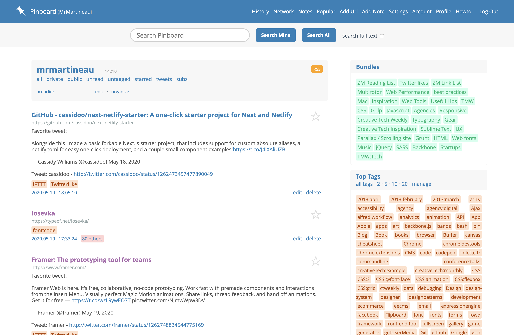
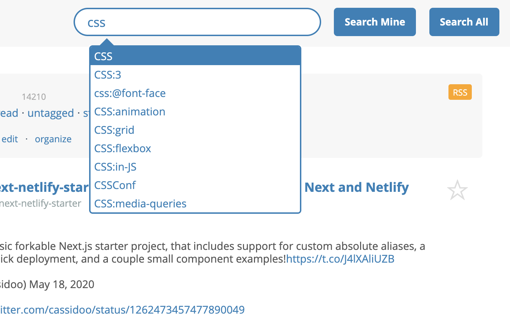

I love [Pinboard](http://pinboard.in), in fact I think I may be a little obsessed with this simple bookmarking service, however, I think its design could do with an update. I created a Chrome extension that cleans up the UI, improves the visual hierarchy & generally makes the site a little more pleasant to use than it already was.

#### Improvements:

- Typography was made more clear and readable by using [Open Sans](http://www.google.com/fonts/specimen/Open+Sans) & by increasing the overall size of the type.
- The UI is now fluid and a few responsive touches have been added so that it made better use of the available screen space.
- Tags and bundles are now much more defined
- The colour scheme was muted slightly and the header
- Stars are larger and clearer

Re-styling the site was not without challenges though, the markup hardly has any classes or IDs, this meant that it was quite difficult to target certain elements when I needed to. Pinboard "just works" TM. It is a simple app that does one thing very well & having investigated the code I can see and appreciate the reasons behind the reluctance to update because if it ain't broke...

### Try the extension for yourself

Head to the [Chrome Web Store](https://chrome.google.com/webstore/detail/pinboard-style/mmcabafimbenknlnlndkdfjgfkkljhmg) to install the extension. I would love some feedback because I know there's a lot that could be improved.

Work has not been completed on the extension, I haven't styled all the pages so some may just look weird, if so, let me know and I will try my best to fix the issue. I will be making my way through the site to tidy up as much as I can.

This marks my first foray into developing Chrome extensions and I hope to make more in the future.
