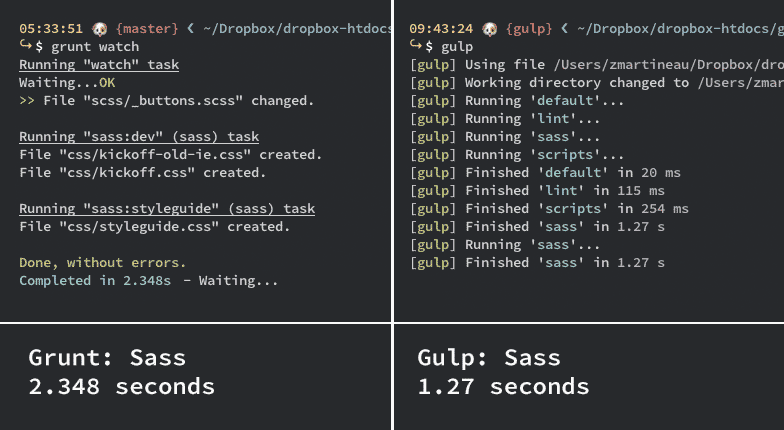
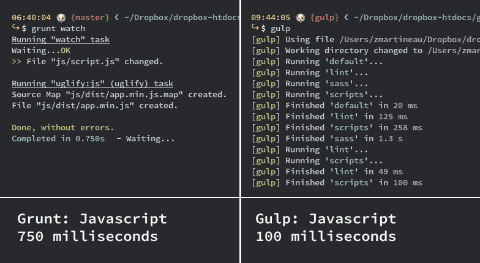

[gulp.js](http://gulpjs.com/) is the new hot young thing on the front-end circuit; it is a task runner similar to [Grunt](http://gruntjs.com). There are many anecdotal reports saying that gulp.js is far quicker than Grunt at performing similar tasks so naturally I wanted to see this for myself using [Kickoff](http://tmwagency.github.io/kickoff/) – the front-end framework we use at TMW – as a Guinea Pig.

Kickoff uses Grunt for a number of tasks; compiling Sass and updating the browser view on-the-fly and concatenating and minifying Javascript for example. Porting this config from Grunt to gulp.js was fairly easy. Travis Maynard has written a great [intro to gulp.js](http://travismaynard.com/writing/getting-started-with-gulp) which made this switch doubly easy.

The gulp.js fork of Kickoff can be found at [github.com/tmwagency/kickoff/tree/gulp](https://github.com/tmwagency/kickoff/tree/gulp) and the [gulpfile.js](https://github.com/tmwagency/kickoff/blob/gulp/gulpfile.js) holds all the config. I found editing the `gulpfile` quite easy; more so than a Gruntfile. I followed similar ideas to our Grunt setup to make it more maintainable e.g. using variables to avoid repetition – see lines [16-37](https://github.com/tmwagency/kickoff/blob/gulp/gulpfile.js#L16-L37) of the Kickoff gulpfile.

## Speed comparison tests

### Sass compilation

Gulp here is about twice as fast as Grunt at running the same task and immediately you can see what all the fuss is about. Grunt uses [grunt-contrib-sass](https://github.com/gruntjs/grunt-contrib-sass) and gulp.js uses [gulp-ruby-sass](https://github.com/sindresorhus/gulp-ruby-sass/) (both of which use Ruby) to compile. gulp-ruby-sass is slower than [gulp-sass](https://github.com/dlmanning/gulp-sass), but more stable and feature-rich so I will make the switch when it improves, so I reckon that the difference will be even greater when this happens. See the gulpfile settings for this [here](https://github.com/tmwagency/kickoff/blob/gulp/gulpfile.js#L51-L65).

### Javascript minification and concatination using Uglify.js

The difference here is not that large but it is still impressive. See the gulpfile settings for this [here](https://github.com/tmwagency/kickoff/blob/gulp/gulpfile.js#L67-L83).

### Live Reload

Live Reload is an indispensable tool for us, both gulp.js and Grunt have plugins for it (Grunt's is built into [grunt-contrib-watch](https://github.com/gruntjs/grunt-contrib-watch)). I was not able to measure the speeds between the two but I would say that gulp.js was noticeably quicker overall, but not hugely.

## Conclusion

As you can see gulp.js is insanely fast, but that does not mean we are going to be making the switch any time soon. There are two plugins that we regularly use that aren't supported by gulp.js, these are [grunt-contrib-connect](https://github.com/gruntjs/grunt-contrib-connect) (for starting a static web server) and [grunt-jekyll](https://github.com/dannygarcia/grunt-jekyll) (for building our Jekyll sites). gulp.js just doesn't have the ecosystem and support that Grunt has; although the one man army of [Sindre Sorhus](https://twitter.com/sindresorhus) might be changing that!

#### Update 16/01/2014

It has come to my attention that people are misinterpreting this post slightly. My purpose was not to provide a scientific comparison of the two but more of a real world, anecdotal comparison, as [Luis Martins](http://tech.tmw.co.uk/2014/01/speedtesting-gulp-and-grunt/#comment-1202435929) states below, there seem to be significant speed gains using gulp.js.

It also seems that there was a misunderstanding, on my part, of what gulp.js is compared to Grunt. I did not realise initially that one could [write the code](https://gist.github.com/mollerse/8450954) (thanks [mollerse](https://github.com/mollerse)) for a static server within the gulpfile, negating the need for a specific plugin. The same could also be said of a specific Jekyll plugin.

In any case, it seems to have got the discussion started about this misconception which can only be a good thing.

#### Update 17/01/2014

[Eric Schoffstall](https://twitter.com/eschoff), creator of gulp.js, actually submitted a [pull request](https://github.com/tmwagency/kickoff/pull/11) on my gulpfile to help improve the accuracy of these timings. As a result, the speed gains are not as significant as I once thought but they are still pretty large. I have updated the screenshots and copy above to reflect these new timings.

## Find out more

- [gulp.js home page](http://gulpjs.com/)
- [gulp.js plugins directory](http://gratimax.github.io/search-gulp-plugins/)
- [gulp.js Github repo](https://github.com/gulpjs/gulp)
- [Introduction to Gulp](http://slid.es/contra/gulp) by it's creator, [Eric Schoffstall](https://twitter.com/eschoff)
- [Getting started with Gulp](http://travismaynard.com/writing/getting-started-with-gulp) by Travis Maynard - great intro to gulp.js
- [Gulp, Grunt, Whatever](http://blog.ponyfoo.com/2014/01/09/gulp-grunt-whatever) by Nicolas Bevacqua - another good intro
