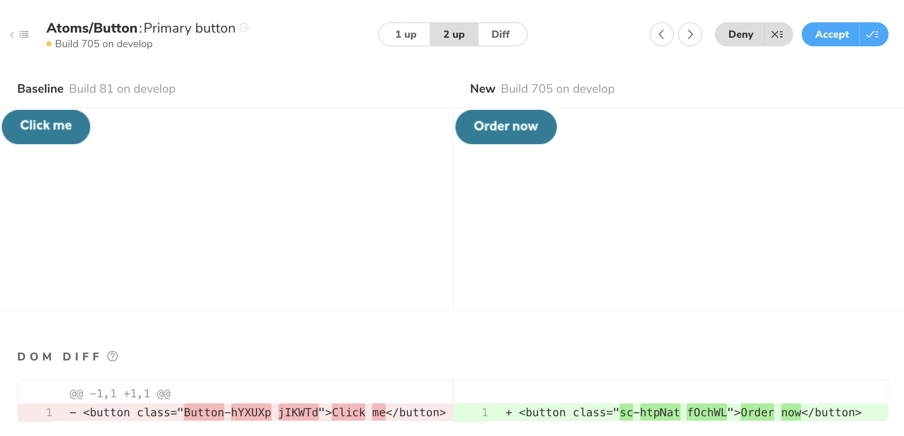

FairFX (now renamed to [Equals](https://equals.co)) needed to rapidly develop a new system to replace their Perl monolith codebase to a more nimble React/Node/serverless ecosystem. How could we do it in time…? Would we be able to build it in time?

In collaboration with our Design and UX team, we created a component library built with React and a few other technologies. We started small, but even at this early stage we were able to identify how it would inevitably grow into a full design system for the business. Why do we need a design system? There are many new websites and apps being created and they all need to look, feel and behave the same. **They need to be consistent.**

## Consistency

Consistency is key for customer experience; without it, customers will not be able to reliably infer meaning from the user interface elements that they use and interact with. It was clear that a design system, which includes a React component library, was needed to ensure our apps and websites had that required consistency. Enter 🗻**_Fuji_**.


[By manucosen at Unsplash.com](https://unsplash.com/photos/n--CMLApjfI)

At the beginning, 🗻*Fuji* started small, we created all the usual suspects: buttons, input fields and textual elements; but is has grown to include so much more. [Design tokens](https://uxdesign.cc/design-tokens-for-dummies-8acebf010d71) were also included from the get-go and we make use of [design system utils](https://github.com/mrmartineau/design-system-utils/), an open source library I created to help reference values from our tokens from anywhere in our apps, specifically in our components.

Why is it called 🗻 Fuji? It’s a tenuous link to our core business: providing foreign currency for people on their holidays. We asked our employees what their favourite holiday destination was, and Mount Fuji was the response with the most votes.

## Efficiencies

Massive re-usability is achieved because we use React and its component architecture, but also because of how we style our components. We use [styled-components](https://www.styled-components.com/), the most popular CSS-in-JS library at the moment.


Developer workflow is a breeze 💨 because we leverage [Storybook](https://storybooks.js.org/), an isolated development environment for our components. It allows us to develop each component individually, outside of any application that we might be working on, and also provide multiple examples for the component to be rendered.

🗻 Fuji’s releases are fully automated, even work-in-progress features are released to npm so our developers can test the work in their apps. This process has been developed specifically for our needs and will be written about in an upcoming blog post. It’s really cool 😎, so make sure you follow [FairFX](https://medium.com/u/4b1d6620f65f) so you will hear about it as soon as possible.

## Reliability

All 🗻 Fuji’s components have some degree of tests to ensure that they do what they say they do. [Jest](https://jestjs.io/) snapshots are invaluable, especially from within our large team so we can be more careful when changing any of our component’s markup and styling.

[ChromaticQA](https://www.chromaticqa.com/) handles our visual regression testing, it works_almost_all the time and is another useful tool to help ensure no regressions make it to production. It is great because it uses Storybook’s stories as the basis for each test.



As with all client-side code at FairFX, 🗻 Fuji uses [Typescript](https://www.typescriptlang.org/), which enables us to trust the code, and provide a more robust output with fewer bugs 🐜 being shipped to end-users 💪.

## Performance

As with everything on the web, performance is very high priority. Fuji uses [Rollup](https://rollupjs.org/) and various Rollup plugins are used to deliver a highly compressed and tree-shakeable [🤔](https://medium.com/@netxm/what-is-tree-shaking-de7c6be5cadd)package so that consumers of the library only get exactly what they want and nothing more.

---

A design system is so much more than a React component library, but we need a base to start with so we can share common functionality and UX patterns. There are currently 3 teams actively developing 🗻 Fuji and consuming it in their apps for the new platform. We have already seen some amazing results and we see no reason why it won’t continue to do so.

You can see the current version of 🗻 Fuji’s storybook at [fuji.fairfx.io](https://fuji.fairfx.io/), which is always the latest production version. The source-code is closed at the moment 💔, but the [npm package](https://www.npmjs.com/package/@fairfx/fuji) is publicly available 🎉.

If you’d like to use 🗻 Fuji in your app, install it using either of these commands:

```sh
yarn add @fairfx/fuji

# or

npm install @fairfx/fuji
```

There is a simple demo hosted on [Codesandbox](https://codesandbox.io/s/r4p91qj4qn) where you can experiment with 🗻 Fuji yourself. We also plan to release a boilerplate version of Fuji so that you can create your own design system, it will include all the styling, testing, storybook and build tooling — and it will be open-source of course 😁.

Fuji always will evolve with the business and development needs. But even in the short time that we have used it, it has already shown how useful and important it is to FairFX.
