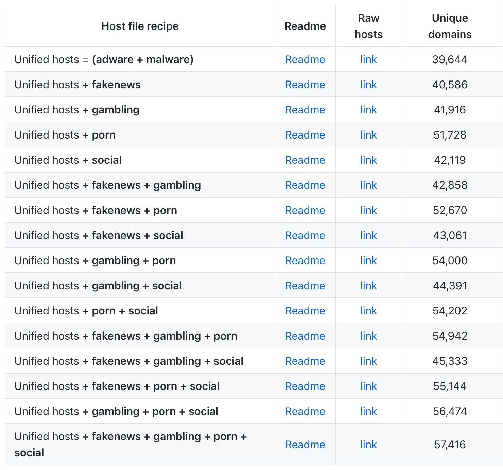
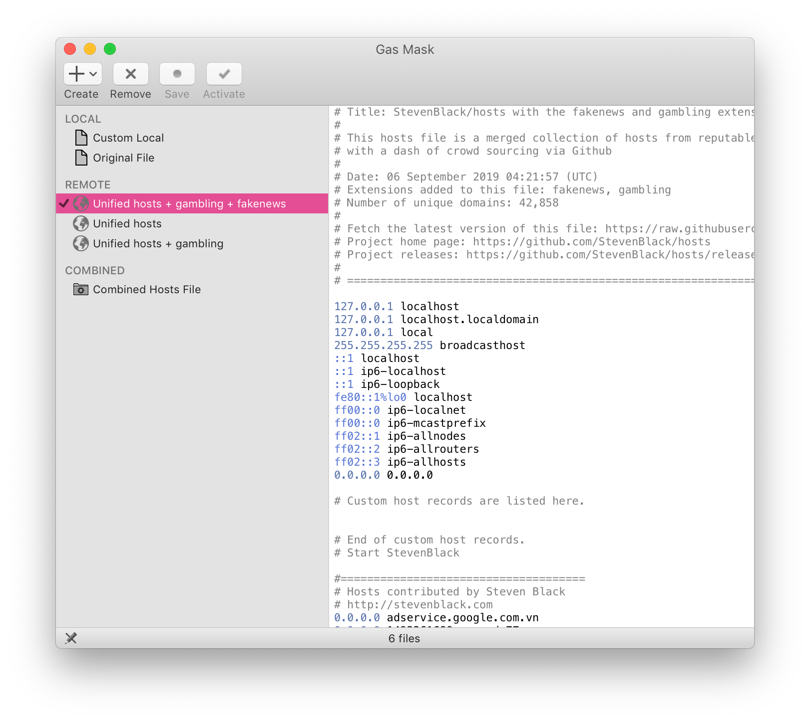
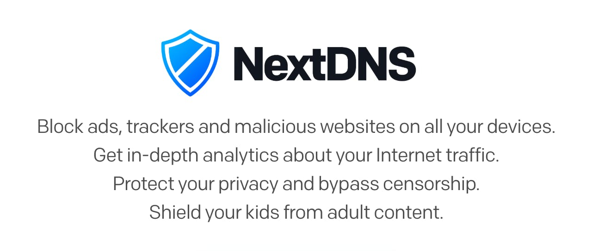

So, you don't want to be tracked online 🙅 by advertisers & analytics scripts etc? What do you do? You need to block them. There are many different ways to achieve this, but I use a few different tools and services to block all these guys.

➡️ Visit [github.com/StevenBlack/hosts](https://github.com/StevenBlack/hosts#list-of-all-hosts-file-variants) and find the "hosts" recipe that you'd like. The "Unified hosts = (adware + malware)" should be sufficient, but you can also find ones that block porn and/or gambling content.

A screenshot of the table of block recipes provided by the StevenBlack repo

If you're on a Mac, download Gas Mask (free) from [clockwise.ee](https://clockwise.ee). If you're on Windows, you can try Unified Hosts AutoUpdate from [github.com/ScriptTiger/Unified-Hosts-AutoUpdate](https://github.com/ScriptTiger/Unified-Hosts-AutoUpdate). Both will allow you to select one of the hosts lists (mentioned above) and have it auto-update at regular intervals.

Screenshot of the Gas Mask app

⚠️ Gas Mask can reference remotely hosted files, but only if they're not https, so use the "Non Github mirror" links from [github.com/StevenBlack/hosts#list-of-all-hosts-file-variants](https://github.com/StevenBlack/hosts#list-of-all-hosts-file-variants), like this one: sbc.io/hosts/hosts.

With this setup, visit an ad-riddled site like theverge.com or mashable.com and see that there are no ads anymore.

By the way, these hosts files don't just block ads, but also trackers, malware, fake news and more that are otherwise hidden to you and other users.

You may find that it isn't working, so have a look at these instructions to find out if you need to reset a few things on your computer: [github.com/StevenBlack/hosts#reloading-hosts-file](https://github.com/StevenBlack/hosts#reloading-hosts-file).

If you want to go one step further, you can setup a Pi-hole. Its a network-level blocking application that runs on a Raspberry Pi or similar device. Any device (smartphone or laptop) on your network is protected without installing apps etc like I outlined in the thread above.

Find out about Pi-hole at [pi-hole.net](https://pi-hole.net)

And if you don't want to setup a Pi-hole, give [nextdns.io](https://nextdns.io) a try. I've been using it for a couple of months now and love it.

A screenshot of the intro from the NextDNS website

NextDNS can be used on both your smartphone and your PC and has many different configurations. Some of the rules are based on the StevenBlack rules (from above), but there is so much more to it. It is my recommended solution.

If you want to level-up even further, I suggest using a VPN like NordVPN. NordVPN is very cheap, does not keep logs of your activity (this is crucial), and is extremely privacy focused.

If you're looking to keep more of your online self private, I suggest you visit [privacytools.io](https://privacytools.io) to find many other tools.

---

👨‍💻 The source for this post was originally one of my Twitter threads: [twitter.com/MrMartineau/status/1128578179730423808](https://twitter.com/MrMartineau/status/1128578179730423808)
