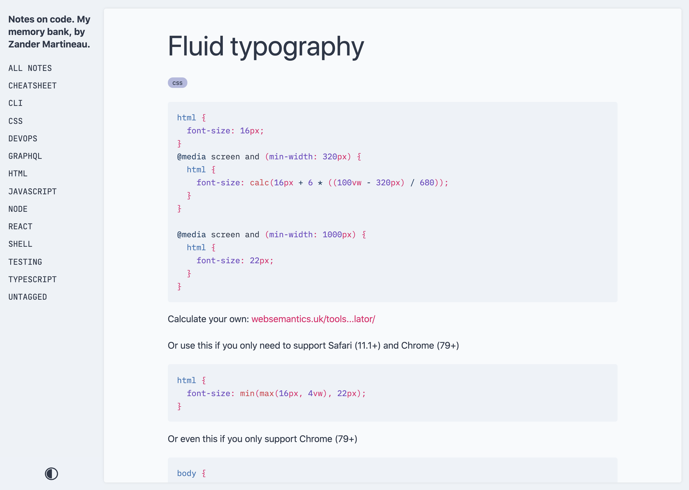
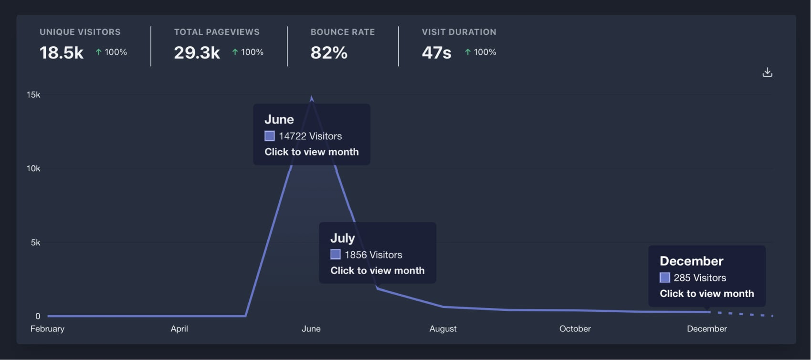
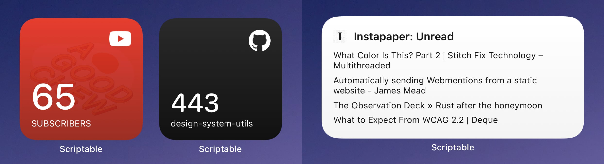

2020 was rough. The pandemic, Brexit, and [IR35](https://en.wikipedia.org/wiki/IR35) all played a part in making things much harder, and in some cases, impossible, for me to work as I'd hoped to. I wasn't able to find contract work for a few months this summer, and it fucking sucked.

Having said that, I am fortunate that I was able to work for most of the year and think I have nearly managed to get things back on track 😅.

## Work

I do a job that I love, working with talented people at amazing and diverse companies and I am lucky to be able to work from home without it affecting my prospects — even during a pandemic.

I've been a contracting for a couple of years now and before March this year I had only worked on a couple of contracts in that time: [FairFX](https://fairfx.com) and [Curve](https://curve.com). After March, however, I had 4 different contracts including a long break in those 8 months.

At the end of March, my contract with Curve finished; it was a brilliant and challenging gig and I think I did some of my best work and worked with some truly talented people while there.

The UK national lockdown began and the looming IR35 legislation meant that many companies decided against renewing contracts or hiring new contractors because they were not prepared for it. IR35 was eventually delayed until April 2021 because of Covid so you think there’d be no issues on that front... how wrong I was.

After that, I contracted with [WQA](https://wearewqa.com) for 6 weeks working on the new [doTERRA Marketplace](https://marketplace.doterra.com) website for their upcoming online conference. This was an e-commerce site built on [Saleor](https://saleor.io), which is like an open-source Shopify framework. I was brought in near the end of the project to re-jig parts of the checkout flow, fix user authentication and improve performance of the site.

When my contract with WQA finished, I was not able to find another for over 3 months. It was a profoundly stressful time for me. New contracts had so many applicants that it became extremely difficult to be considered for a gig or even find one that had competitive rates.

Not knowing when the next contract would come along really put me on the back foot; but I had to keep busy for fear of going totally nuts, so I focused on Code Notes, read about that below...

After a few months, I eventually started a _very_ short-term contract (3 weeks) with [Hackney City Council](https://hackney.gov.uk), and after that with [Club View](https://clubview.io) for 6 weeks.

Things feel like they are slowly getting back to normality (even if the UK is spiralling out of control) because I have been contracting with [Heights](https://yourheights.com) since September and I am really getting my teeth stuck into the work there.

Contracting allows me to dip in and out of companies and work on a wide variety of projects and I love it; plus, I avoid office politics which cannot be underestimated. However, I am starting to crave some normality/security in my life so I have been think about moving back to full-time — who knows what 2021 may bring.

## Side-projects

I continued to work on a number of side-projects; some came out better than expected, and others stagnated.

My side-project ideas list grows by the day, and being a parent to a 3-year-old means I don't spend much time working on them, but they are a great way for me to explore ideas and to create. Here are some highlights:

### "Code Notes" Gatsby theme

I created a [Gatsby theme](https://github.com/mrmartineau/gatsby-theme-code-notes) for my code notes. Install the theme, add a markdown or MDX file to a folder and that's pretty much it.

After the [initial commit](https://github.com/mrmartineau/gatsby-theme-code-notes/commit/96004bce717cb9e5fbde3723306be20a38a2c262) on 9th Feb, this project has been something of an obsession for me. It scratched an itch I had for what I needed as a second brain (as people like to call them these days) for my code-related notes. My [launch blog post](/blog/code-notes-release) goes into more detail about this.

The theme was well received and continues to be maintained and iterated on and [notes.zander.wtf](https://notes.zander.wtf) is where my notes reside. I tend to it like a garden and find myself referring to it constantly. Of course, the notes are only for my benefit, but there's some good stuff there so I recommend you check it out if you have a similar need.

Version 2 of the theme [is in the works](https://github.com/mrmartineau/gatsby-theme-code-notes/pull/91) and will be released shortly. It includes some design improvements and allows users to sort the notes by date instead of alphabetically.

### zander.wtf 2020 reboot

I redeveloped this website and moved it away from next.js to Gatsby. I wrote about the process [here](/blog/site-redesign-2020) and continue to evolve on it whenever I get a spare moment.

My favourite part of the site is the ["Likes"](/likes) page where I share articles and links that I like and think others would also be interested in. I will be writing a blog post about the tech behind it soon because I think others may find it useful.

Before this iteration, I did not use analytics because I am a big privacy advocate and [usually block](/blog/not-tracked-online) as many tracking/ads scripts as possible. However, I wanted to write more and needed analytics to see how each post performed. I chose [Plausible Analytics](https://plausible.io), a light-weight and privacy-focused analytics provider.

As you can see from the image below, I don’t get much traffic to the site, but when I released Code Notes, the [launch blog post](/blog/code-notes-release) garnered quite a few views.

### Unnamed, unfinished project

I spent a few months in the latter half of the year working on a new site for some friends. I worked on it after hours and at weekends and ultimately had to quit the project because I burned-out, or came damned near to it. The mental energy I needed to manage it, my “day job” and not neglect my family meant that I could not deliver what was needed in time and to a quality that I found acceptable.

From a technical perspective, the project used Gatsby, Prismic CMS and a search implementation based on Flexsearch.

I started using DatoCMS but due to budget limitations, found that it was not feasible. However, Dato is what I would recommend if someone asked me for a good headless CMS.

### Scriptable widgets

With the help of [Scriptable](https://scriptable.app), I created a few different widgets for my iPhone and [on Mac](https://scriptable.app/mac-beta/).

I made a couple for YouTube channel admins, like my brother for his new cooking channel, [A Good Chew](https://www.youtube.com/channel/UCaeTwbBs3tezU9MUi25z5MQ); another for showing your GitHub repo stars; and lastly one to show your Instapaper unread items. Find the repo for all of them [here](https://github.com/mrmartineau/scriptable-widgets).

I love that with no iOS dev knowledge I can create things that live on my phone’s home screen using a language that I use every day: JavaScript.

### Rigel VS Code theme

I ported the [Rigel Vim theme](https://rigel.netlify.app/) to VS Code. It was the first theme I've created for the IDE and I was very pleased with the result.

Download the theme from the [VS Code marketplace](https://marketplace.visualstudio.com/items?itemName=mrmartineau.rigel-vscode) or search "Rigel" in VS Code's Extensions tab. The [repo](https://github.com/mrmartineau/rigel-vscode) is here if you're interested.

### Awesome Web Dev Links

This project is a [readme](https://github.com/mrmartineau/awesome-web-dev-resources) on GitHub with web development resources and npm packages that I've tried, tested and recommend. There are many similar "awesome" lists but I never found one on this subject that I liked, so I made my own.

I have been planning to make it into a proper website that is searchable and categorised to make it easier to find things. Of course, that is one more thing to add to my side-projects to-do list.

It might seem strange to mention a readme, but along with [notes.zander.wtf](https://notes.zander.wtf), it is a resource that I refer to daily and is invaluable to me.

If I can improve my working life _and_ share my knowledge/experience at the same time then that makes me happy.

## Technology

### Gatsby

I have focused a lot on [Gatsby](https://gatsbyjs.com) this year: we used it at Curve; for my Code Notes theme, and now at Heights. I have, however, concluded that it is not a technology I'd like to spend any more time using.

Don't get me wrong, it was the gateway drug for me using GraphQL (for that I am thankful), but it manages to make making a website so incredibly complex for all but the simplest of sites.

My Code Notes theme is a perfect use-case for Gatsby, but for the more complicated, multi-language site driven by a headless CMS and other APIs it becomes very difficult to manage effectively.

For similar requirements and tech, I would now recommend Next.js, I believe the project is heading in a better direction than Gatsby. Jared Palmer wrote a more in-depth article on [Gatsby vs. Next.js](https://jaredpalmer.com/gatsby-vs-nextjs) and I agree with his assessment:

> Over the past few months, I’ve moved as much code as possible away from Gatsby. While I see why people are attracted to it and its growing ecosystem, I am no longer sipping the KoolAid.

### CSS

I have been using [Theme UI](https://theme-ui) on many different projects. It is incredibly powerful but I am, like Jared said, "no longer sipping the KoolAid".

The `sx` prop has become a bit of a crutch and allows for more overrides than ought to be necessary, especially when creating component libraries.

Both Curve and Height's design systems use Theme UI; it enabled both dev teams to create components extremely quickly, but sometimes at the expense of quality.

[Tailwind](https://tailwindcss.com) and [Stitches](https://stitches.dev/) are two projects that have really piqued my interest and I will certainly be using them on something soon. I used Tailwind while at Club View but I don't think it was set up properly so I want to delve deeper because the more I look at it, the more I think it might be the perfect way to style on the web.

Stitches has more of a Theme UI vibe to it, but with its variants and composability, it looks like an excellent CSS-in-JS library for modern applications.

---

## 2021 and beyond

What will 2021 bring? An end to Covid and a return to normal life? Perhaps, but not if Boris Johnson has anything to do with it. Personally, though, I want to expand my skillset so I can provide more value to my clients.

I want to focus more on web performance, API design and finally figure out how the hell AWS works. We shall see...

---

P.S. Writing this post was something I felt I needed to capture if only for myself, and I’m pretty sure nobody will read this. If you got this far, tweet me a stupid gif to let me know you what you thought.
