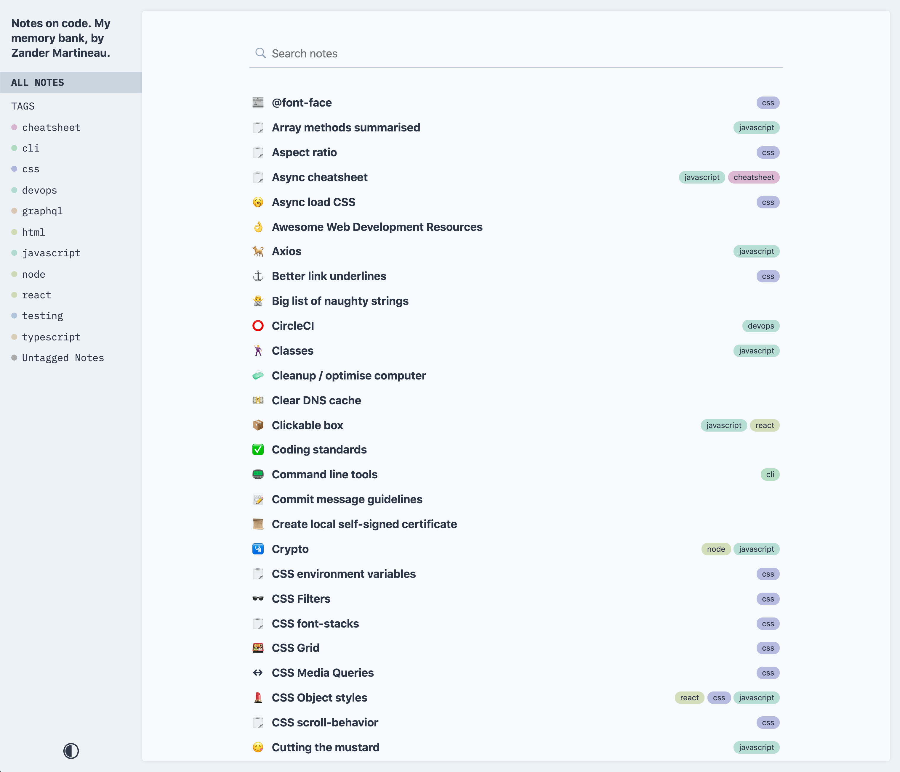

Like a lot of developers I spend a lot of my time searching Google for answers to things that I should know how to do. For example, how to write a `link` tag from memory.. apologies if that triggers some of you :joy:. Rather than keep searching for answers to problems that I've solved many times in the past, I started making notes so that I could easily reference them.

These code-related notes included snippets; examples from previous projects; explanations of how/why/when to do something; and even straight-up duplications of some [documentation](https://notes.zander.wtf/axios#handling-errors) that I often search for. I have tried quite a few apps and services; some had great features like having a menubar app that allowed me to easily search then paste in a certain snippet, some had great organisation capabilities, and others were allowed for multiple snippets per note. Unfortunately though, none had all the features of what I wanted from a code notes app so I decided to create my own and this post will give you a little insight into how my solution was made and works.

I created [**Code Notes**](https://github.com/mrmartineau/gatsby-theme-code-notes), a theme for [Gatsby](https://www.gatsbyjs.org) that gives you all the control over how you write, publish and store your notes — you have full ownership. Having it be a website was immediately appealing to me because it is searchable and shareable by default; I often found myself sending colleagues a link to one of my notes.


GitHub hosts [my notes](https://github.com/mrmartineau/notes.zander.wtf) which means the notes are versioned using Git so others can fork my notes or I can revert if needed.



All notes are written in MDX or markdown. MDX is an extension of markdown that enables you to write `JSX` or `HTML` within the notes and they will render. This means the notes can be interactive, so you can show a code snippet and a preview right next to each other 🚀. `iframe`s can also be added so gists, Codepens or even Figma designs can be included in your notes.

Notes are fully searchable too 🔍, including all code snippets. I integrated [Flexsearch](https://github.com/nextapps-de/flexsearch) and made a few optimisations to improve the search speed — I'll write a blog post about that soon.


The design of this theme is intentionally simple to allow for the notes to be as legible as possible. There are multiple themes: light and dark of course.


Notes also look great on mobile:


## How do you make your own notes site?

If you're familiar with Gatsby, setting this theme up shouldn't be too hard. That being said, even if you're new to Gatsby, I think you should be able to set it up fairly easily. I created a Gatsby starter for just this purpose. Using the `gatsby-cli`, run this:

```sh
gatsby new code-notes https://github.com/MrMartineau/gatsby-starter-code-notes
```

This will create a basic site with a single note. Once installed or cloned locally and all packages are installed you can begin developing your site.

If you'd rather not use the `gatsby-cli`, you can clone the start repo like so:

```sh
git clone git@github.com:MrMartineau/gatsby-starter-code-notes.git

cd code-notes

yarn
```

Creating your first note is pretty simple too, just add a new file e.g. `my-note.mdx` inside the `notes` directory and add this content:

```md
---
title: My note
emoji: 🐳
tags:
  - test
link: https://zander.wtf
---

This is a test note.
```

I have been adding features over the past few months and now believe that it is ready for wider usage. Please give it a try and let me know what you think, I would love to hear any and all feedback. **Code Notes** is open source (of course) so you can contribute or file bugs to it at [github.com/mrmartineau/gatsby-theme-code-notes](https://github.com/mrmartineau/gatsby-theme-code-notes).

---

If you're interested, here's some info about some of the previous apps I used.

[Notion](https://notion.so) is perhaps an unlikely contender for an app of this sort, but it actually suited me pretty well for about a year. Search, tagging and syntax highlighting worked great, but it was slow to use and I became frustrated. I do recommend it if you already use it.

[SnippetsLab](https://www.renfei.org/snippets-lab) ($9.99), [Quiver](http://happenapps.com/#quiver) ($9.99) and [Boostnote](https://boostnote.io/) (free) served me very well for a few years. They are purpose-built for storing code snippets and were quick, but notes were not as accessible as I would want and there was no preview.
