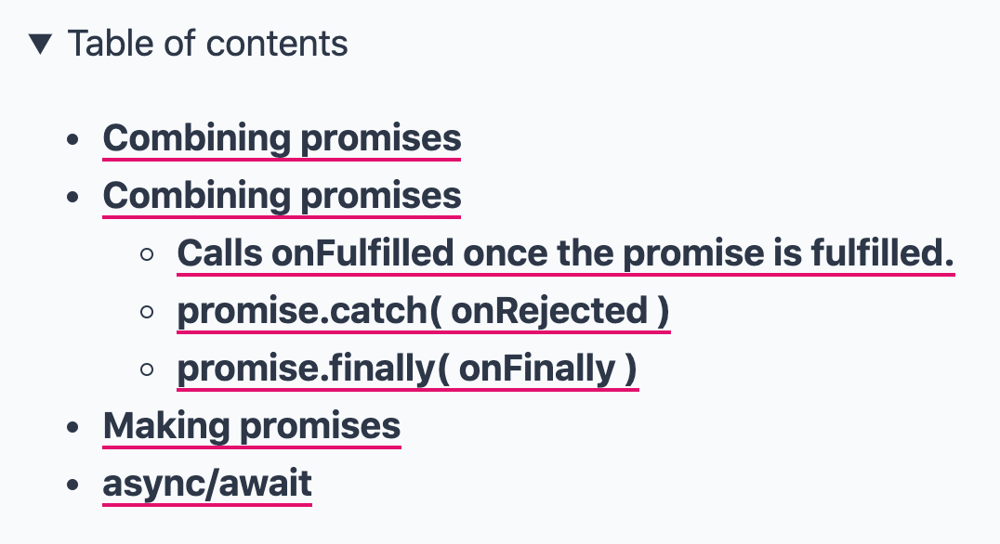

This post is a deep-dive into a small part of my [Code Notes](https://github.com/mrmartineau/gatsby-theme-code-notes) Gatsby theme, it assumes you have a basic knowledge of Gatsby and how to query data in GraphQL.

I wanted to provide a table of contents for each note, which like many you've seen before on documentation sites, provides a helpful way to navigate large notes. See a screengrab of how they look here:



Gatsby provides access to the very useful `tableOfContents` GraphQL query when using markdown or mdx. A simplified example query for a single note looks like this:

```js
export const pageQuery = graphql`
  query NoteById($id: String!) {
    mdx(id: { eq: $id }) {
      body
      frontmatter {
        title
      }
      tableOfContents
    }
  }
`
```

With that, my page component now has access to the `tableOfContents` data, no matter how deep the heading levels go. Using [gatsby-plugin-mdx](https://www.gatsbyjs.org/packages/gatsby-plugin-mdx/) we are able to query the depth of the headings too, like so: `tableOfContents(maxDepth: 3)`. This would only return `h1-h3` headings. Below you can see some example headings taken from my article on [Kickoff's custom grids](/blog/how-to-create-custom-grids-with-kickoff/).

```json
{
  "items": [
    {
      "url": "#the-difference-between-the-kickoffs-grid-and-block-grids",
      "title": "The difference between the Kickoff’s grid and block grids"
    },
    {
      "url": "#creating-your-own-version",
      "title": "Creating your own version",
      "items": [
        {
          "url": "#sass-to-the-rescue",
          "title": "Sass to the rescue",
          "items": [
            {
              "url": "#include-column3",
              "title": "@include column(3);"
            },
            {
              "url": "#percentage12",
              "title": "percentage(1/2);"
            }
          ]
        }
      ]
    },
    {
      "url": "#modifying-your-creation-with-changes-to-viewport-width",
      "title": "Modifying your creation with changes to viewport width",
      "items": [
        {
          "url": "#tipsforkickoff",
          "title": "#tipsForKickoff"
        }
      ]
    }
  ]
}
```

You will notice that the returned data is an array of objects, with the same nested structure for subheadings. This is where it gets a little more complex when we want to render the table of contents on our page. Because of this nested structure, we first need to loop through the first level array, then check if there are child arrays within each item and so on and so forth.

## Creating the components

To achieve this, I created three separate components, and for the purposes of this example, they are not styled in any way. The first was the initial `Contents` component which is passed the entire `tableOfContents` data through props. I ensured that nothing would render if there was a note that doesn't use any headings (e.g. an empty array).

```jsx
export const Contents = ({ tableOfContents }) => {
  if (!tableOfContents.items) {
    return null
  }

  return <ContentsList items={tableOfContents.items} />
}
```

The next two components render a list of contents items (`ContentsList`) and an individual content item (`ContentsItem`).

```jsx
const ContentsList = ({ items }) => {
  return (
    <ul>
      {items.map(item => {
        return <ContentsItem key={`${item.url}-item`} item={item} />
      })}
    </ul>
  )
}

const ContentsItem = ({ item }) => (
  <li>
    <a href={item.url}>{item.title}</a>

    {/**
     * conditionally render another `ContentsList` within this `<li>`
     * if there is a `items` array within this `item`
     */}
    {item?.items?.length ? (
      <ContentsList key={`${item.url}-list`} items={item.items} />
    ) : null}
  </li>
)
```

The components above are fairly simple, but the important part is where the `ContentsList` is conditionally rendered based on if there are any child `items` data for a given item. No guarding is necessary in the `ContentsList` component because it would never render based on the other guards in place.

## Usage

Now we have the three components setup, all that's left is to add the `Contents` component to your page.

```jsx
<Contents toc={tableOfContents} />
```

On reflection the `Contents` component could be removed if you conditionally render the `ContentsList` component — it depends what you prefer at this point:

```jsx
{
  tableOfContents.items && <ContentsList items={tableOfContents.items} />
}
```

You can take a look at how my `Contents` component is used in gatsby-theme-code-notes [here](https://github.com/mrmartineau/gatsby-theme-code-notes/blob/master/gatsby-theme-code-notes/src/components/NotePage/NotePage.tsx).
