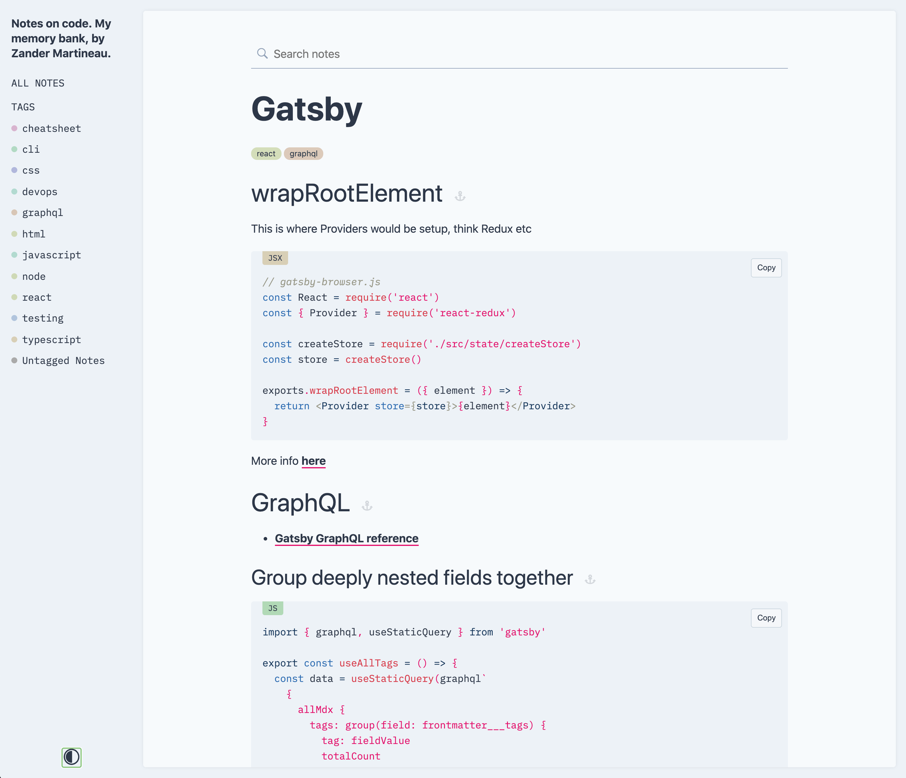
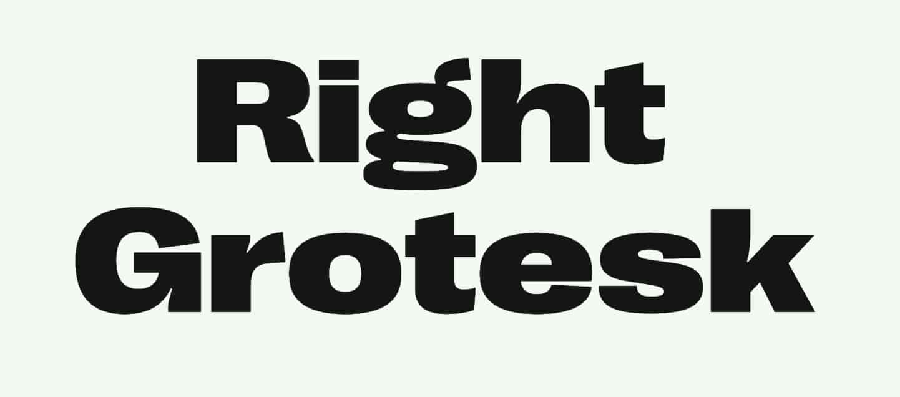

I must be a glutton for punishment, because I have just completed another redesign for _my_ personal website only a year or so after doing it before. Why would you do it to yourself, man? I'll tell you why.. I believe in practising what you preach.. or at least what you get paid professionally to do, so over the past couple of months I have been working on a new version of my site using technologies that I know are going to keep me employable.

My previous site (which can still be found at [2019.zander.wtf](https://2019.zander.wtf)) was built using [next.js](https://nextjs.org) and was perfect for what I needed to power my personal site. This time around though, I wanted to change how I authored content on my site, I wanted more control in how each article was created and rendered, particularly when it came to code examples and embeds, and that is where [Gatsby](https://www.gatsbyjs.org) excels, when coupled with MDX and it's plethora of plugins. My previous site used [Prismic](https://prismic.io) (a headless CMS) to manage content, but it's rich text editor had its limitations in what it could do for me so I needed a change.

I used Gatsby extensively at [Curve](https://curve.com) (both the existing and upcoming Curve.com websites use it) and I recently created a Gatsby theme to manage my code-related notes, imaginatively named ["Code Notes"](https://github.com/mrmartineau/gatsby-theme-code-notes), so I have a good deal of experience with it.



## Process

For this new site, I wanted to keep most of the same things as the previous site: the blog, the work listing and the two feeds on the likes page - let's be honest, that _was_ the entire site. I spent a good while breathing-in inspiration from wherever I could get it, with a particular focus on typography. Like every site that I create for myself, I wanted it to be distinctive, but as I am not a designer by day (I did used to be though..), I needed a little help.

### Design inspiration

I scoured my favourite sites: [siteInspire](https://www.siteinspire.com/), [Awwwards](https://www.awwwards.com/) and my personal favourite for sites that are a bit out-there, [hoverstat.es](https://www.hoverstat.es).

I saw a few that had big, bold Grotesk style fonts and knew I needed a piece of that action. I also wanted to see if I could keep using a monospace font, like I already did. This hopefully would allow for interesting juxtaposition between the two. Below are a few of the examples I took a heavy inspiration from:

I love **[Mackenzie Child's](https://www.mackenziechild.me/)** style and really like his faux interface elements that he uses on his site. I wanted to do something similar but in the end, I opted against it but did take some inspiration from some smaller details that he uses.


The design for **[Center](http://hello.center.design/)** provided a super bold and in-your-face approach that I toyed with for a while. Again I ultimately opted against it because I had done a bit of that in previous designs. I did however, try the same typeface that they used in my designs ([Ginto Nord](https://abcdinamo.com/typefaces/ginto) if you're interested), but it wasn't to be.


**[Matthieu Teyssandier](http://matthieuteyssandier.com/)** ended up providing not only the typeface (Monument Extended), but also a large piece of inspiration for how I wanted my projects to be listed. I tried many other options of course, but the simplicity and boldness of having only the name of the project really spoke to me. I added the date to the listing and kept a similar variant of what I used before to disclose each project's detailed info using `<details>`/`<summary>` elements.


Both Center and Matthieu's designs sealed it for me that I needed a bold Grotesk, but I needed to find the right one that suited me.

### Typography

Having seen Monument Extended on Matthieu's site, I wanted to see what other fonts the Pangram Pangram Foundry had. As well as [Monument Extended](https://pangrampangram.com/products/monument-extended), I found [Right Grotesk](https://pangrampangram.com/products/right-grotesk) which had a little more character than Monument. It had more pronounced ink-traps, but I opted not to use it because I preferred Monument.




I looked for typefaces on other people's websites but used sites like [Font Review Journal](https://fontreviewjournal.com/) and [Typewolf](https://www.typewolf.com) to see if I could find any other typefaces I could use.

[Space Grotesk](https://fonts.floriankarsten.com/space-grotesk) also looked great but it did not have a bold enough weight for my needs.


[Hanson Bold](https://hansonmethod.com/hansonbold) by Hanson Method is similar to Monument, I can't remember the site where I first saw it, but it was the font I chose for the majority of the design process.


I always liked the typeface that Figma uses, it has very pronounced inktraps so I hunted it down and found that it was called [Whyte Inktrap](https://abcdinamo.com/typefaces/whyte). This did have a heavy and black weights but I felt that they did not look great when used in the way that I wanted.


As I mentioned above, [Ginto Nord](https://abcdinamo.com/typefaces/ginto) Bold from the Center website is lovely.


My previous site used [IA Writer Duospace](https://github.com/iaolo/iA-Fonts), which I never realised was based on [IBM Plex Mono](https://www.ibm.com/plex/). I decided to switch from Duospace to using Plex Mono instead.


In the end, I chose **Monument Extended Ultrabold** and **IBM Plex Mono**.

### Design

I use Figma for any and all design work these days, it has changed the way I collaborate with a design team. I went through many iterations testing out different typographic pairings, colour schemes and layout ideas before starting to code it all out.

In the Figma embed below, you can see multiple variants of the home page, and like my previous iteration, everything was supposed to stay on the one page. Only during development did I decide to split each section out into separate pages. What I designed was definitely not complete, but it gave me enough to go on when I started coding.

<iframe
  style="border: 1px solid rgba(0, 0, 0, 0.1);"
  width="99%"
  height="450"
  src="https://www.figma.com/embed?embed_host=share&url=https%3A%2F%2Fwww.figma.com%2Ffile%2FU2j8AAsSfaCjWUkB7bgPMuII%2Fzander.wtf%3Fnode-id%3D61%253A22&chrome=DOCUMENTATION"
  allowfullscreen
></iframe>

### Development

I've used [Theme UI](https://theme-ui.com) for a few projects and design-systems recently and really enjoy the constraint-based flow that it provides. Strangely, I feel I am able to be a lot more creative with it because I know that if I used it _correctly_, the components that I create will not break any layout rules. Font-sizing, spacing, typography and much more all use common tokens that are setup within the Theme UI config and they allow me to just create stuff whilst staying within the boundaries of my theme - it is incredibly powerful.

#### Blog

As I said before, one of the reasons I chose Gatsby was that I wanted more control over how my articles were rendered. It is possible to use MDX with Next.js, but I know that supported for it isn't as good as Gatsby, does even though there are multiple [mdx](https://github.com/vercel/next.js/tree/canary/packages/next-mdx) [plugins](https://github.com/hashicorp/next-mdx-enhanced). This was a shame because I knew that I would have to rebuild absolutely everything for this new site 😞.

On top of the `gatsby-mdx-plugin` I used a few remark and gatsby-remark plugins to make further improvements. If you're interested, take a look at my `gatsby-config.js` file [here](https://github.com/mrmartineau/zander.wtf-2020/blob/master/gatsby-config.js#L33-L61).

#### Likes

The "Likes" page makes use the [Pinboard](https://pinboard.in) API and [Vercel's](https://vercel.com) Serverless Functions. The serverless function is needed because CORS is not enabled on Pinboard's API. You can see the source code below if you're interested.

```ts
import { NowRequest, NowResponse } from '@now/node'
import axios from 'axios'

export default async (req: NowRequest, res: NowResponse) => {
  const requestPath = `https://feeds.pinboard.in/json/u:MrMartineau/t:${req.query.tag}/?count=10`
  const { data } = await axios(requestPath)
  res.setHeader('Content-Type', 'application/json')
  res.statusCode = 200
  res.end(JSON.stringify(data))
}
```

To fetch the data from the serverless function, I used the excellent [SWR](https://swr.now.sh/) library which I hadn't used before. I wanted to try it on various projects so it was great to give it a go, if only for this very simple use-case. I hadn't realised that the feed would update itself while the user was viewing the page, that the view would automatically update; I can definitely see myself using that in future projects.

The way in which I manage this page might be of interest to you; they are based on specifically tagged items in my Pinboard feed, [Instapaper](https://www.instapaper.com) and [IFTTT](https://ifttt.com). For the reading list, I use [`zm:reading`](https://pinboard.in/u:MrMartineau/t:zm:reading/) and for the link list I use [`zm:link`](https://pinboard.in/u:MrMartineau/t:zm:link/). WHen I "like" an article in my [Instapaper feed](https://www.instapaper.com/p/MrMartineau), IFTTT adds a new tagged item in Pinboard. The `zm:link` tagged items are added manually.

When either of those two tagged items are added to Pinboard, there is another couple of IFTTT applets that automatically tweet on my behalf about them. I'm still not sure if people find them useful because most of my Twitter feed ends up being these tweets or retweets - I use Twitter a lot but I don't engage with it too much.

---

I hope this peek under the curtain has given you some insight on how I approach things, it was a fun project and gave me a decent outline while we're all in lockdown. The site is never finished though, there are many things that I want to add but haven't found the time to do yet. For one, I want sound effects like [Josh Comeau](https://joshwcomeau.com/) has, and I want to improve the homepage to make it more playful and interactive. All in due course.
